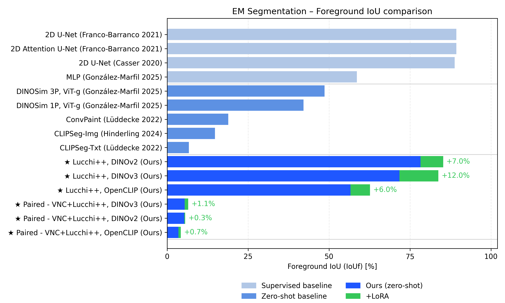

# Microscopy Foundation Hub

[](https://arxiv.org/abs/2602.08505)
[](LICENSE)
[](https://www.python.org/)

Benchmark of vision foundation models for microscopy segmentation. Three pretrained
backbones, one lightweight convolutional decoder, three adaptation regimes — evaluated
across electron microscopy, light microscopy, and histopathology.



> **Built for SLURM.** All experiments ran on the UZH ScienceCluster (H100 GPUs), and every
> sweep in `slurm/` is a job array. The Python entrypoints run locally too, but the
> reproducible path is `sbatch`.

## Backbones

| Backbone | Variants | Patch | Pretraining | Weights |
|---|---|---|---|---|
| **DINOv2** | ViT-S/B/**L**/g | 14 | LVD-142M, self-supervised | Public (`torch.hub`) |
| **DINOv3** | ViT-S/B/**L**/16 | 16 | LVD-1689M, self-supervised | Gated — requires approved access |
| **OpenCLIP** | ViT-**L**-14, ViT-H-14 | 14 | LAION-2B, image–text | Public (`open-clip-torch`) |

Main results use the Large variants. Backbone choice is config-driven — see
`configs/backbones/` for one example block per family.

## Adaptation regimes

All three regimes train the same decoder (1×1 stem → four transposed-conv upsampling blocks
→ 1×1 logits → bilinear resize to input resolution). They differ only in the backbone.

| Regime | Backbone | Trained | Config keys |
|---|---|---|---|
| **Frozen + seg. head** | Frozen | Decoder only | `use_lora: false`, `full_finetune: false` |
| **LoRA** | Frozen + low-rank adapters | Decoder + adapters | `use_lora: true` |
| **End-to-end** | Fully trainable | Everything | `use_lora: false`, `full_finetune: true` |

LoRA targets ViT attention projections only (`target_policy: vit_attention_only`). Rank and
α are not uniform across the benchmark: the EM runs and every OpenCLIP run use rank 16 / α 32,
while the DeepBacs and MoNuSAC DINOv2 and DINOv3 runs use rank 8 / α 16. Each config states
its own values explicitly.

## Datasets

| Domain | Datasets | Target |
|---|---|---|
| Electron microscopy | Lucchi++, Kasthuri++, Drosophila VNC | Mitochondria |
| Light microscopy — DeepBacs | *E. coli*, *S. aureus*, *B. subtilis* | Bacterial cells |
| Histopathology — MoNuSAC | Epithelial, Lymphocyte | Nuclei |

EM and DeepBacs are also trained on multi-dataset composites: **paired** (two sources) and
**triplet** (all three), built with `scripts/data/compose_{em,deepbacs}_datasets.py`. A small
Open Images subset serves as the natural-image reference in the domain-shift analysis.

EM images are resized on the longest edge to a multiple of the backbone patch size; DeepBacs
and MoNuSAC keep native resolution with a paired 448×448 center crop. MoNuSAC patches vary
too widely in size for that alone, so `scripts/data/prepare_monusac_448.py` first drops
patches under 200 px and resizes those below 448 px.

## Installation

```bash
conda env create -f configs/environments/cluster-conda.yml   # or mac-conda.yml
conda activate dino-peft
pip install -e .
```

The environment and the importable package are both named `dino_peft`, which predates
the project's current scope; `import dino_peft` is correct in this repository.

DINOv2 and OpenCLIP weights download on first use; set `backbone.weights` to a local
checkpoint on offline clusters. **DINOv3 requires approved access** — once granted, clone
[facebookresearch/dinov3](https://github.com/facebookresearch/dinov3), download the
checkpoint, and point your config at both:

```yaml
backbone:
  name: dinov3
  variant: vitl16
  repo_dir: /path/to/dinov3
  weights: /path/to/dinov3_vitl16_pretrain_lvd1689m-8aa4cbdd.pth
img_size:
  patch_multiple: 16   # 16 for DINOv3, 14 for DINOv2 and OpenCLIP
```

## Running experiments

`slurm/` is organised by domain (`em/`, `deepbacs/`, `monusac/`, `domain_shift/`) and holds
two kinds of file:

- **`submit_*.sh`** — submits a full sweep (every dataset × regime × seed) as job arrays.
  This is the intended entrypoint.
- **`grid_*.sbatch`** — the job itself. Each array task writes a temporary YAML from a base
  config with the requested overrides, runs `train_em_seg.py` then `eval_em_seg.py`, and
  archives its SLURM log into the run directory. The shared machinery lives in
  `slurm/lib/common.sh` and `scripts/utils/make_runtime_cfg.py`, so a sweep script only
  describes what is specific to it.

Sweeps are driven by exported environment variables; `--array=0-4` runs the five seeds that
every reported number averages over.

```bash
bash slurm/deepbacs/submit_dinov3_single.sh   # 3 species × 3 regimes × 5 seeds
bash slurm/monusac/submit_dinov3_single.sh    # 2 cell types × 3 regimes × 5 seeds

# one cell of the grid
sbatch --array=0-4 --export=ALL,DATASET=subtilis,TUNING_MODE=lora \
  slurm/deepbacs/grid_dinov3_large.sbatch
```

Common variables: `DATASET` / `COMBO`, `TUNING_MODE` (`head` | `lora` | `fullft`), `REPEATS`,
`BASE_SEED`, `BASE_SPLIT_SEED`, `BASE_CFG`.

Seeds are shared across backbones on purpose — every sweep runs seeds 1–5 with split_seeds
101–105 — so a DINOv3-minus-OpenCLIP difference is not also a difference of train/val split.

### One backbone, end to end

`slurm/submit_openclip_all.sh` submits a whole backbone's benchmark and queues a summary job
behind it, so the sweep reports itself:

```bash
NOTIFY_EMAIL=you@example.org bash slurm/submit_openclip_all.sh
DRY_RUN=1 bash slurm/submit_openclip_all.sh     # print what it would submit
```

That is 20 array jobs / 100 tasks: EM (Lucchi++, Kasthuri++, VNC, joint triplet), DeepBacs
(*E. coli*, *S. aureus*, *B. subtilis*, joint triplet) and MoNuSAC (epithelial, lymphocyte),
each × 2 regimes × 5 seeds. The two regimes are **frozen** and **end-to-end** — the OpenCLIP
sweep leaves LoRA out, and `MODES="head fullft lora"` puts it back without any other change.
Narrow it further with `DOMAINS="em monusac"`, or submit one domain at a time with
`slurm/{em,deepbacs,monusac}/submit_*_openclip.sh`.

Before committing the whole sweep, `slurm/pilot_openclip.sh` runs six five-epoch jobs —
EM triplet, DeepBacs triplet and MoNuSAC epithelial, frozen and end-to-end — into a
throwaway `<scratch_root>/openclip-pilot` tree:

```bash
bash slurm/pilot_openclip.sh            # submit
bash slurm/pilot_openclip.sh --report   # read it back when they finish
```

Every run records `peak_gpu_mem_gib` and `train_seconds_per_epoch` in `metrics.json`, so
the report answers whether end-to-end fits in GPU memory and how long a full run will take
from measurements rather than an estimate. It also shows, for the two joint runs, which
per-source names came out — an empty column there means the per-dataset breakdown is not
being produced and the sweep is not ready.

The summary job depends on all of them with `afterany` — a sweep with two crashed cells still
produces a report naming them — runs `summarize_seg_results.py` over the whole backbone tree,
and mails the digest. Cells with fewer than five repeats are flagged. It is also fine to run
on its own at any point:

```bash
sbatch --export=ALL,NOTIFY_EMAIL=you@example.org slurm/openclip_summary.sbatch
```

The **joint** runs (EM triplet, DeepBacs triplet) report a per-source foreground IoU alongside
the pooled one. That breakdown is switched on by the substring `triplet` appearing in the run's
data paths, `task_type` or `experiment_id` — the configs and sweeps all carry it, but it is
worth knowing before renaming anything, because losing it removes the per-dataset numbers
silently rather than failing.

**Before your first submission,** edit the cluster-specific paths at the top of each
`grid_*.sbatch` — `PY`, `DATA_ROOT`, `RESULTS_ROOT`, and the DINOv3 `WEIGHTS` location. The
configs under `configs/cluster/` likewise carry absolute paths from the original machines.

To run a single job locally, for debugging:

```bash
python scripts/train_em_seg.py --cfg configs/cluster/EM/lucchi_dinov3_lora_cluster.yaml
python scripts/eval_em_seg.py  --cfg configs/cluster/EM/lucchi_dinov3_lora_cluster.yaml
```

## Configuration and outputs

Every parameter lives in YAML under `configs/`; CLI flags and sbatch variables only override
config values. A config states what makes it different and inherits the rest via
`extends: defaults`, and refers to machine paths as `${data_root}`, `${scratch_root}` and so
on, which resolve from `configs/paths.yaml`. **To run on another machine, edit that one file**
— or override any entry from the environment:

```bash
export DINO_PEFT_DATA_ROOT=/my/datasets
export DINO_PEFT_SCRATCH_ROOT=/my/results
```

Training uses AdamW and Dice loss with a 10% validation split and early stopping (patience 20,
max 1000 epochs). Each run writes `<results_root>/<modality>/<task_type>/<experiment_id>/`
containing `config_used.yaml`, `run_info.txt`, `metrics.json`, `ckpts/`, `figs/`, and `logs/`.
`metrics.json` holds mean and foreground IoU/Dice, plus per-source metrics for composite runs.

The repository also covers feature extraction, PCA/UMAP, Mahalanobis OOD detection,
Fréchet-distance domain analysis, and result aggregation — see
[`scripts/README.md`](scripts/README.md) for all entrypoints and
[`configs/README.md`](configs/README.md) for the configuration map.

## Citation

If you use this work, please cite the preprint
[arXiv:2602.08505](https://arxiv.org/abs/2602.08505); the BibTeX entry is on the arXiv page.

**Datasets**

- **Lucchi++ / Kasthuri++** — Casser, Kang, Pfister & Haehn (2020), *Fast mitochondria
  detection for connectomics*, MIDL. Refines Lucchi et al. (2012) and Kasthuri et al. (2015).
  [Download](https://casser.io/connectomics)
- **Drosophila VNC** — Gerhard, Funke, Martel, Cardona & Fetter (2013), *Segmented anisotropic
  ssTEM dataset of neural tissue*.
  [Download](https://github.com/unidesigner/groundtruth-drosophila-vnc)
- **DeepBacs** — Spahn, Gómez-de-Mariscal, Laine et al. (2022), *DeepBacs for multi-task
  bacterial image analysis using open-source deep learning approaches*, Communications Biology.
- **MoNuSAC** — Verma, Kumar, Patil et al. (2021), *MoNuSAC2020: A multi-organ nuclei
  segmentation and classification challenge*, IEEE TMI.

## Acknowledgements

- **[DINOv2](https://github.com/facebookresearch/dinov2)** (Meta AI) — the backbones and
  pretraining weights we adapt to microscopy via PEFT.
- **[FD-DINOv2](https://github.com/justin4ai/FD-DINOv2)** — basis of our Fréchet-distance
  measurement of domain shift between DINOv2 feature distributions.
- **Stein et al.** (NeurIPS 2023), *Exposing flaws of generative model evaluation metrics and
  their unfair treatment of diffusion models* — motivates replacing Inception features with
  self-supervised embeddings in Fréchet-based scores.
- **DINOSim**, *Zero-shot object detection and semantic segmentation on electron microscopy
  images* — its characterisation of the microscopy domain gap motivates our evaluation focus.

Please respect the licenses of upstream repositories (DINOv2, DINOv3, OpenCLIP) and of any
dataset you use; their terms apply to weights, code, and data used within this project.

## License

MIT — see [LICENSE](LICENSE).
